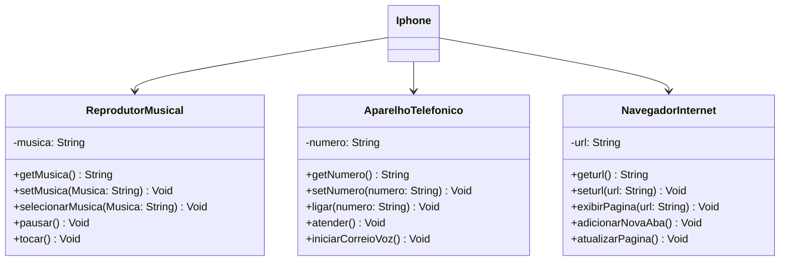

# Java-dio-DesafioUML

## ATIVIDADES DO DESAFIO
1. Criar um diagrama UML que represente as funcionalidades descritas acima.
2. Implementar as classes e interfaces correspondentes em Java (Opcional).
   ### Implementação feita com menu responsivo com a utilização de todos os recursos ensinados em aula.

## UML
### Exemplo de Diagrama UML (Mermaid)

    Iphone --> ReprodutorMusical
    Iphone --> AparelhoTelefonico
    Iphone --> NavegadorInternet
'''
